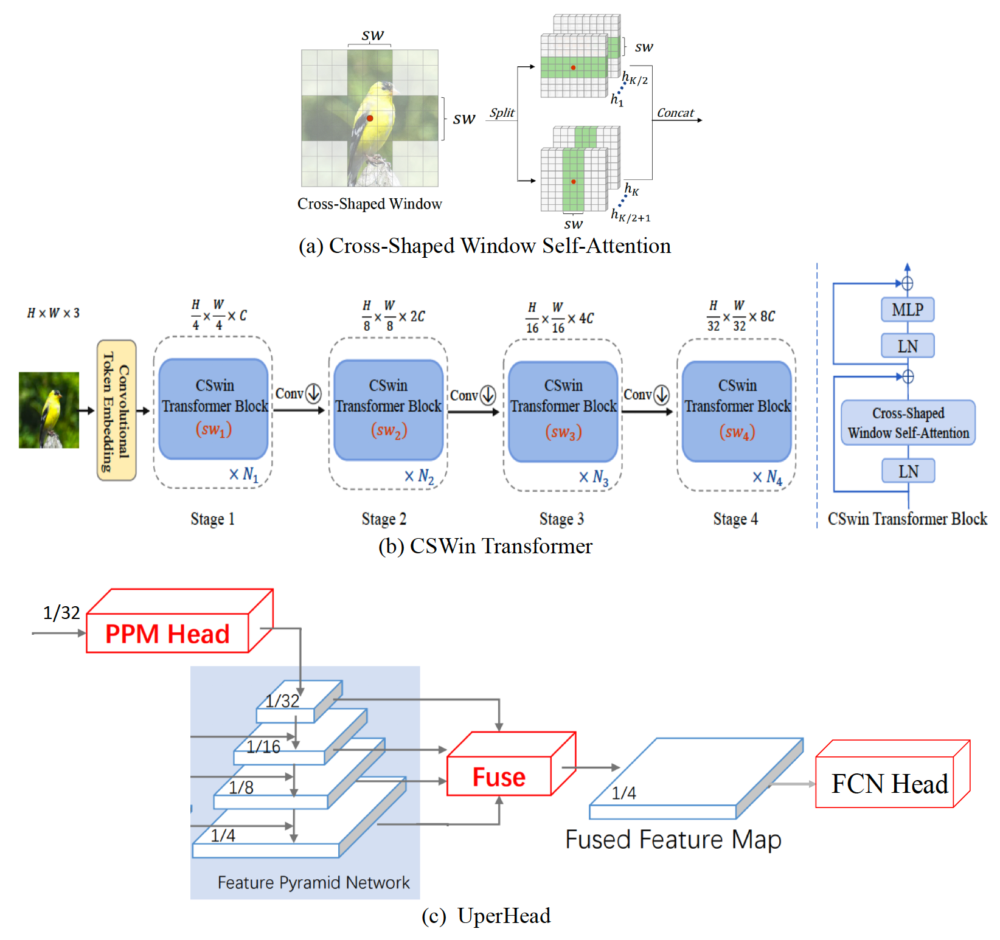

# Swin Transformer: Hierarchical Vision Transformer using Shifted Windows, [arxiv](https://arxiv.org/pdf/2103.14030.pdf)
# CSWin Transformer: A General Vision Transformer Backbone with Cross-Shaped Windows, [arxiv](https://arxiv.org/pdf/2107.00652.pdf)

## Framework


## Model Zoo ##
### ADE20K ###
|Model      | Backbone  | Batch_size | Iteration | mIoU (ss) | mIoU (ms+flip) | Backbone_checkpoint | Model_checkpoint     |     ConfigFile  |
|-----------|-----------|------------|-----------|-----------|----------------|-----------------------------------------------|-----------------------------------------------------------------------|------------|
| UperNet  | CSwin_Tiny |     16     |     160k   |  49.46   |           |[baidu](https://pan.baidu.com/s/1ol_gykZjgAFbJ3PkqQ2j0Q)(l1cp) | [baidu](https://pan.baidu.com/s/1gLePNLybtrax9yCQ2fcIPg)(y1eq)  |  [config](seman}tic_segmentation/configs/upernet_cswin/upernet_cswin_tiny_patch4_512x512_160k_ade20k.yaml) |
| UperNet  | CSwin_Small |     16     |     160k   |  50.88   |      | [baidu](https://pan.baidu.com/s/1mSd_JdNS4DtyVNYxqVobBw)(6vwk)   | [baidu](https://pan.baidu.com/s/1a_vhHoib0-BcRwTnnSVGWA)(fz2e)   | [config](semantic_segmentation/configs/upernet_cswin/upernet_cswin_small_patch4_512x512_160k_ade20k.yaml) |
| UperNet  | CSwin_Base |     16     |     160k   |  50.64   |      | [baidu](https://pan.baidu.com/s/1suO0jX_Tw56CVm3UhByOWg)(0ys7)   | [baidu](https://pan.baidu.com/s/1Ym-RUooqizgUDEm5jWyrhA)(83w3)   | [config](semantic_segmentation/configs/upernet_cswin/upernet_cswin_base_patch4_512x512_160k_ade20k.yaml) |
## Reference
```
@article{dong2021cswin,
  title={Cswin transformer: A general vision transformer backbone with cross-shaped windows},
  author={Dong, Xiaoyi and Bao, Jianmin and Chen, Dongdong and Zhang, Weiming and Yu, Nenghai and Yuan, Lu and Chen, Dong and Guo, Baining},
  journal={arXiv preprint arXiv:2107.00652},
  year={2021}
}
@inproceedings{xiao2018unified,
  title={Unified perceptual parsing for scene understanding},
  author={Xiao, Tete and Liu, Yingcheng and Zhou, Bolei and Jiang, Yuning and Sun, Jian},
  booktitle={Proceedings of the European Conference on Computer Vision (ECCV)},
  pages={418--434},
  year={2018}
}
```
