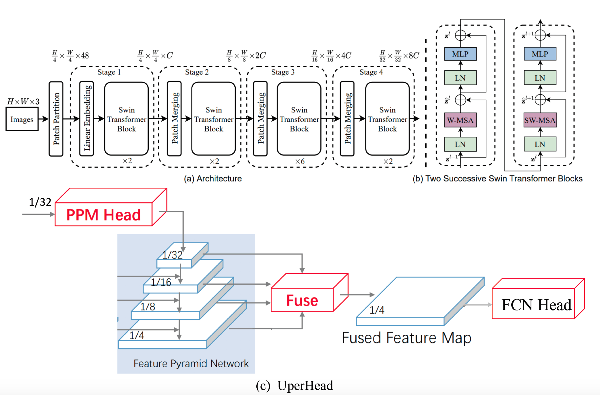

# Swin Transformer: Hierarchical Vision Transformer using Shifted Windows, [arxiv](https://arxiv.org/pdf/2103.14030.pdf)

The official pytorch implementation is [here](https://github.com/SwinTransformer/Swin-Transformer-Semantic-Segmentation)
## Framework


## Model Zoo ##
### ADE20K ###
|Model      | Backbone  | Batch_size | Iteration | mIoU (ss) | mIoU (ms+flip) | Backbone_checkpoint | Model_checkpoint     |     ConfigFile  |
|-----------|-----------|------------|-----------|-----------|----------------|-----------------------------------------------|-----------------------------------------------------------------------|------------|
| UperNet  | Swin_Tiny |     16     |     160k   |  44.90   |       45.37     |   -      |[baidu](https://pan.baidu.com/s/1S8JR4ILw0u4I-DzU4MaeVQ)(lkhg)   |  [config](semantic_segmentation/configs/upernet_swin/upernet_swin_tiny_patch4_windown7_512x512_160k_ade20k.yaml) |
| UperNet  | Swin_Small |     16     |     160k   |  47.88   |       48.90      |   -      |[baidu](https://pan.baidu.com/s/17RKeSpuWqONVptQZ3B4kEA)(vvy1)   |  [config](semantic_segmentation/configs/upernet_swin/upernet_swin_small_patch4_windown7_512x512_160k_ade20k.yaml) |
| UperNet  | Swin_Base |     16     |     160k   |   48.59   |       49.04      |   -      |[baidu](https://pan.baidu.com/s/1bM15KHNsb0oSPblQwhxbgw)(y040)   |  [config](semantic_segmentation/configs/upernet_swin/upernet_swin_base_patch4_windown7_512x512_160k_ade20k.yaml) |

## Reference
```
@article{liu2021swin,
  title={Swin transformer: Hierarchical vision transformer using shifted windows},
  author={Liu, Ze and Lin, Yutong and Cao, Yue and Hu, Han and Wei, Yixuan and Zhang, Zheng and Lin, Stephen and Guo, Baining},
  journal={arXiv preprint arXiv:2103.14030},
  year={2021}
}
@inproceedings{xiao2018unified,
  title={Unified perceptual parsing for scene understanding},
  author={Xiao, Tete and Liu, Yingcheng and Zhou, Bolei and Jiang, Yuning and Sun, Jian},
  booktitle={Proceedings of the European Conference on Computer Vision (ECCV)},
  pages={418--434},
  year={2018}
}
```
